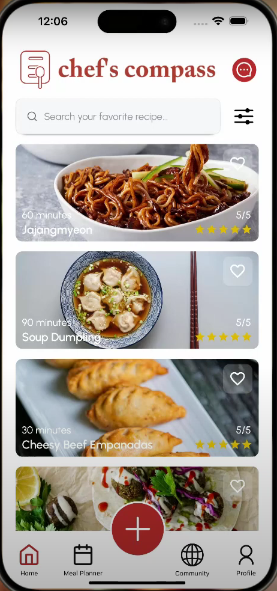

# Chef-Compass

## Description:

Chef's Compass is your intuitive recipe app, simplifying your cooking journey. With a user-friendly interface, it offers a wide variety of delicious recipes suitable for every occasion. What sets Chef's Compass apart is its intuitive grocery list generator and meal planner, ensuring you have all the ingredients you need for each meal. This will solve your problems of taking too much time to make your grocery list and planning what to eat each day.

Chef’s Compass also allows you to note down your recipe. You will have the option to make them public for the entire Chef's Compass community to enjoy or keep them private for your personal collection. This app will solve your problem of organizing recipe notes or keeping a cookbook since everything you want to save or look up is in Chef’s Compass.

[Here is the production video of our software!](https://youtu.be/5-yikacxQUU)

Here is the QR code for our app **[Deprecated because we have shut down Amazon RDS endpoint due to cost and this project has finished]**:

## Snapshots:

    
    

## Features:

1. **Recipe Repository**

   - Users can create and explore a vast collection of recipes.
   - Advanced search and filter functions based on ingredients, cuisine type, and cooking level.
   - Detailed recipe information pages with instructions, preparation and cooking times, pictures, and cooking level indicators (e.g., beginner, easy, etc.).
   - Adjustable ingredient quantities for scaling recipes to desired serving sizes.

2. **Meal Plan and Grocery List**

   - Simplifies meal planning and shopping.
   - Integrated calendar for weekly or monthly meal planning.
   - Automatic generation of comprehensive shopping lists based on selected recipes.
   - Consolidates all necessary ingredients to streamline grocery shopping and reduce the chance of missing items.

3. **Community Features**

   - Fosters connection and collaboration among users.
   - Users can connect with friends and other cooking enthusiasts.
   - Share and discover new recipes within the community.
   - See recipes shared by friends to exchange culinary ideas and inspiration in a supportive environment.

4. **Social Interaction and Recipe Sharing**
   - Friend system to connect with other users.
   - Community page to engage with a larger group of cooking enthusiasts.
   - Recipe sharing functionality to easily share favorite recipes with friends.
   - Integrated chat system for communication and collaboration using polling technique.

## Tooltips:

- **Jira & Confluence**
- **GitHub**
- **Microsoft Teams v2**
- **Google Console**
- **Amazon Web Services (AWS) Console**
  - Lambda
  - API Gateway
  - Relational Database Services (RDS)
- **MySQL Workbench**
- **Postman**
- **Figma**
- **Expo Go**
- **Real Devices (Android & iOS devices)**

## Contributors

Johnnie Tran: Full-stack developer (team leader)

https://github.com/lethienantran

Mark Clemmer: Full-stack developer

https://github.com/mclemmer7

Binh Pham: Full-stack developer

https://github.com/Binh-SPU

Anudari Batsaikhan: UI/UX Designer, Scrum Master

https://github.com/anukann

Nidhi Mejadiya: UI/UX Designer
